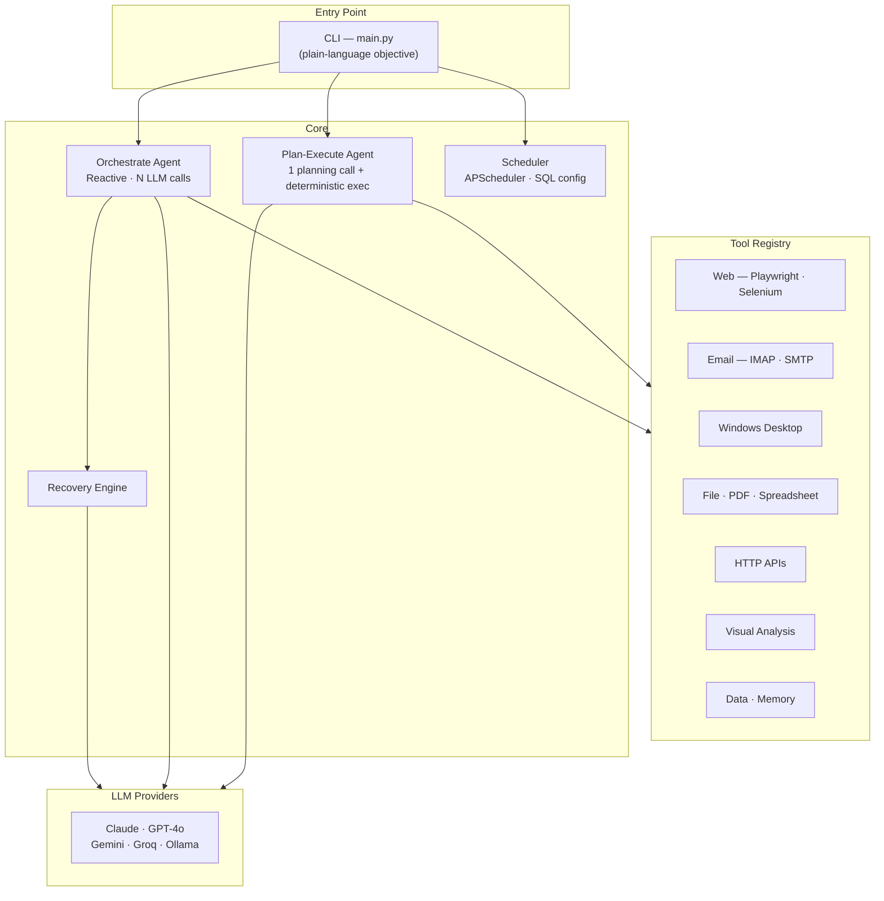
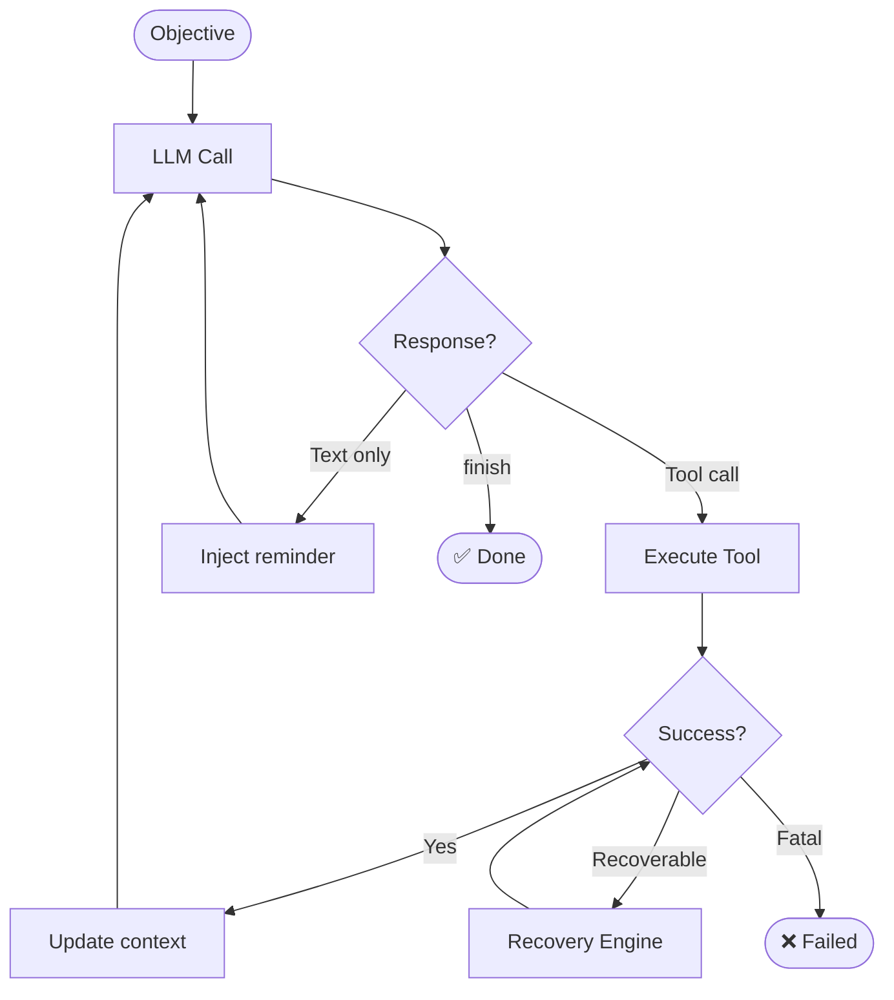
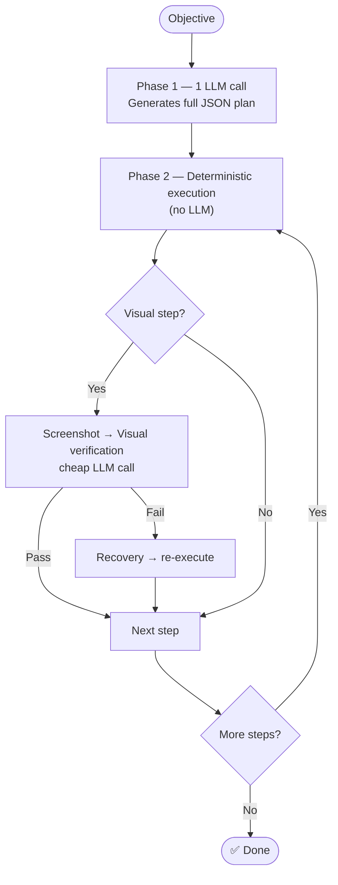
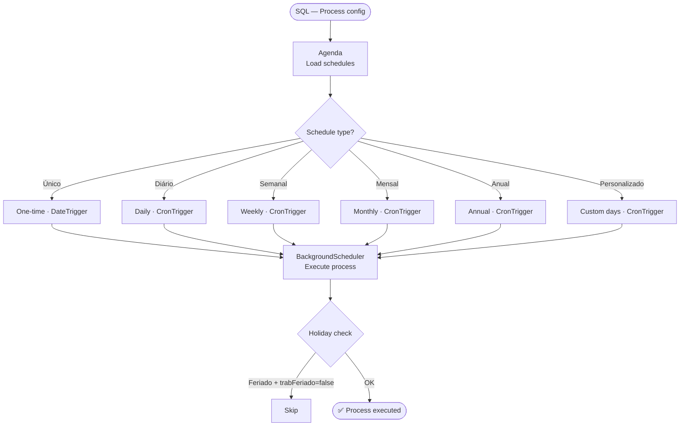

# 🤖 Autonomous AI Agent

  
  
  
  
  
  
  

> O código-fonte é proprietário e confidencial. Este repositório serve como referência de portfólio.
> The source code is proprietary. This repository serves as a portfolio reference only.

---

Agente de IA autônomo desenvolvido em Python que recebe um objetivo em linguagem natural e executa tarefas complexas de automação de ponta a ponta — decidindo quais ferramentas usar, em qual ordem, e se recuperando de erros automaticamente até concluir a tarefa.

### Modos de operação

| Modo | Descrição |
|---|---|
| `orchestrate` | Loop reativo — o modelo decide cada passo em tempo real via múltiplas chamadas ao LLM |
| `plan_execute` | O modelo gera um plano completo em 1 chamada e a execução é determinística, sem novos LLM calls |

Após a primeira execução, o agente salva o plano e pode **reexecutar a mesma tarefa com zero custo de API** (Record & Replay).

### Funcionalidades

- **Multi-LLM:** Claude (Anthropic), GPT-4o (OpenAI), Gemini (Google), Llama via Groq e modelos locais via Ollama — troca de provedor via configuração
- **Caixa de ferramentas:** +30 ações cobrindo automação web (Playwright/Selenium), desktop Windows, e-mail (IMAP/SMTP), planilhas (Excel), PDFs, APIs REST, gerenciamento de arquivos e análise visual multimodal via screenshots
- **Agendador de processos:** módulo com APScheduler para execuções únicas, diárias, semanais, mensais, anuais e personalizadas, com controle de feriados e configuração via SQL
- **Recuperação automática:** motor que detecta falhas recuperáveis e as corrige sem interromper a tarefa
- **Controle de custo:** rastreamento de tokens e custo em USD por execução, com suporte a Prompt Caching da Anthropic

---

## 🏗️ Architecture

---

## 🔄 Flows

### Orchestrate Mode

### Plan-Execute Mode

### Scheduler

---

## 🛠️ Technology Stack

| Category | Technologies |
|---|---|
| **Language** | Python 3.10+ · asyncio |
| **LLM Providers** | Claude (Anthropic) · GPT-4o (OpenAI) · Gemini (Google) · Llama/Groq · Ollama |
| **Web Automation** | Playwright · Selenium |
| **Desktop Automation** | pywin32 · ctypes |
| **Email** | imaplib · smtplib |
| **Spreadsheets / Docs** | openpyxl · pdfplumber · pandas |
| **Scheduling** | APScheduler · SQL |
| **HTTP / APIs** | httpx · aiohttp |
| **Architecture** | Tool Registry · Plan-Execute · Record & Replay · Auto-Recovery · Multi-Provider |

---

## 👤 Author

**Gabriel Paulino**
- GitHub: [@gabrielborralhogomes](https://github.com/gabrielborralhogomes)
- LinkedIn: [gabrielborralho](https://www.linkedin.com/in/gabrielborralho)
- Email: gabrielborralho98@gmail.com

---

> *Este projeto é proprietário. Este repositório serve apenas como referência de portfólio.*
> *This project is proprietary. This repository serves as a portfolio reference only.*
